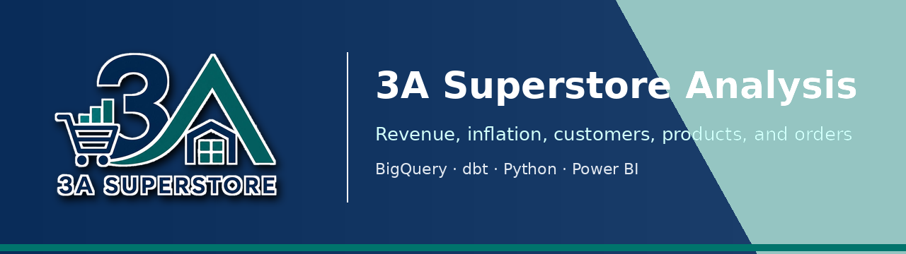

<p align="center">
  
</p>

<p align="center">
  <a href="https://3a-superstore-analysis.vercel.app">
    
  </a>
  <a href="https://docs.getdbt.com/docs/core/connect-data-platform/bigquery-setup">
    
  </a>
  <a href="https://www.python.org/">
    
  </a>
</p>

# 3A Superstore Analysis

3A Superstore Analysis is an end-to-end analytics project on retail transaction data from a Turkish supermarket. We used BigQuery, dbt, Python notebooks, Power BI to turn raw supermarket orders into documented business analysis covering revenue growth, inflation adjustment, customer behavior, regional performance, category trends, and retention opportunities.

Our case-study version of the project is deployed here:

**[3A Superstore Analysis project site](https://3a-superstore-analysis.vercel.app)**

It includes the analysis pages, dataset notes, team ownership, and dbt model documentation.

## What We Built

- A BigQuery warehouse workflow for the 3A Superstore raw tables: orders, order details, customers, branches, and product categories.
- A layered dbt project with staging, intermediate, and mart models for repeatable analytics definitions.
- CPI-adjusted revenue modeling using monthly TCMB EVDS CPI data to compare nominal revenue with real revenue.
- Dashboard-ready marts for revenue trends, KPI cards, product price validation, branch performance, customer 360, and RFM analysis.
- Python notebooks for exploration, validation, monthly revenue forecasting, branch forecasting, and recommendation experiments.
- Power BI dashboards for business-facing analysis and storytelling.
- A Zensical website deployed on Vercel as the public project writeup and technical portfolio artifact.

## Core Analyses

- [Revenue Performance & Inflation Analysis](https://3a-superstore-analysis.vercel.app/analyses/inflation-adjusted-revenue/) - nominal vs. real revenue, CPI adjustment, product price validation, and inflation-aware KPIs.
- [Sales & Revenue Insights](https://3a-superstore-analysis.vercel.app/analyses/sales-revenue/) - sales trends, order volume, geographic revenue patterns, and forecasting.
- [Customer Growth Opportunities](https://3a-superstore-analysis.vercel.app/analyses/customer-growth/) - cross-sell opportunities, churn signals, basket diversity, and high-value customers.
- [Customer Health](https://3a-superstore-analysis.vercel.app/analyses/customer-health/) - customer value segmentation, health stages, and retention priorities.
- [Customer Retention & RFM Analysis](https://3a-superstore-analysis.vercel.app/analyses/customer-retention-rfm/) - RFM segments, active customer rate, revenue at risk, and retention strategy.
- [Region & Category Performance](https://3a-superstore-analysis.vercel.app/analyses/regional-revenue/) - regional revenue concentration and category contribution by geography.
- [Category Trends](https://3a-superstore-analysis.vercel.app/analyses/category-performance-trends/) - category revenue, sales quantity, order activity, and category mix over time.

## Dataset

This project uses the Kaggle dataset [3A Superstore (Market Orders Data-CRM)](https://www.kaggle.com/datasets/cemeraan/3a-superstore), published by Kaggle user `cemeraan`.

Because the sales data is denominated in Turkish lira during a high-inflation period, we supplemented the transaction dataset with monthly CPI data from [TCMB EVDS](https://evds3.tcmb.gov.tr). This lets the revenue analysis compare nominal sales with inflation-adjusted real revenue rather than relying only on current-price totals.

## Tools Used

| Tool | Role |
| --- | --- |
| BigQuery | Warehouse, raw table storage, SQL exploration, and analytics outputs. |
| dbt | Transformation modeling, layered data marts, documentation, and tests. |
| Python, Jupyter, Google Colab | EDA, validation, forecasting, and modeling experiments. |
| pandas, Polars, Plotly, scikit-learn, Prophet | Notebook analysis and model development. |
| Power BI | Final dashboards and business-facing visuals. |
| Zensical, Vercel | Public project writeup and static site deployment. |

## Repository Structure

| Path | Purpose |
| --- | --- |
| `superstore/` | dbt project for BigQuery transformations, model tests, and CPI seed data. |
| `notebooks/` | Exploratory analysis, validation, forecasting, and modeling notebooks. |
| `docs/` | English Zensical website content and dashboard assets. |
| `docs-tr/` | Turkish Zensical website content. |
| `queries/` | Ad hoc SQL checks and exploration queries. |
| `scripts/` | Supporting scripts, including TCMB EVDS CPI seed generation. |
| `vercel.json` | Vercel build configuration for the static Zensical site. |

## Running Locally

Install the Python environment:

```bash
uv sync
```

Start Jupyter Lab:

```bash
uv run jupyter-lab
```

Build the English project site locally:

```bash
uv run zensical build -f zensical.toml --clean
```

Run dbt from the `superstore/` directory after configuring a local BigQuery dbt profile:

```bash
cd superstore
dbt seed
dbt run
dbt test
```

## Team

This was built as a team analytics project. See the [team page](https://3a-superstore-analysis.vercel.app/about/team/) for ownership by analysis area.
