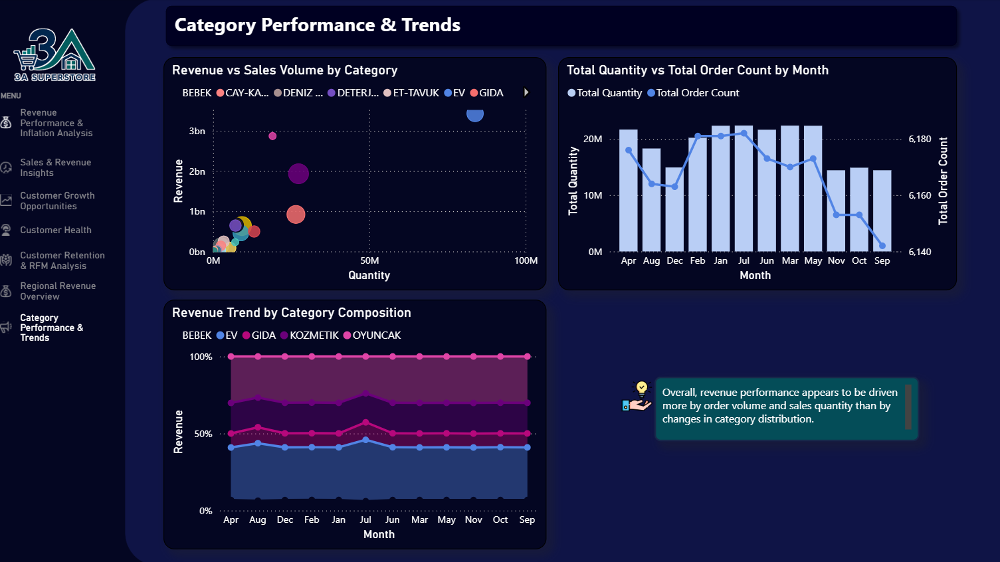

# Kategori Performansı ve Trendleri

!!! note "Özet"

    Kategori performansı, kategori karmasında büyük değişimlerden çok sipariş aktivitesi ve satılan adet tarafından sürükleniyor gibi görünüyor.

    `EV` gelir ve satış hacmi açısından öne çıkan görünür kategori; genel kategori kompozisyonu ise zaman içinde görece stabil kalıyor.

    Bu, işletmenin stabil müşteri kategori tercihleri etrafında plan yapabileceğini; ancak baskın kategorilere bağımlılığı da izlemeye devam etmesi gerektiğini gösterir.

Dashboard kategori seviyesinde talebe odaklanır. Kategori geliri, satış adedi, sipariş sayısı ve kategori kompozisyonunu zaman içinde karşılaştırır.

## İş Sorusu

Bu analiz bir kategori planlama sorusuna odaklanır:

> Hangi kategoriler geliri sürüklüyor ve müşteri kategori tercihleri zaman içinde değişiyor mu?

Yanıt için kategoriye göre gelir, satılan adet, aylık sipariş aktivitesi ve kategori kompozisyonu karşılaştırıldı.

## Kanıtlar Ne Gösteriyor?

-   :lucide-chart-scatter:{ .lg .middle } __Gelir hacmi takip ediyor__

    ---

    Kategori bubble chart'ında daha yüksek hacimli kategoriler genellikle daha yüksek gelir üretir.

-   :lucide-home:{ .lg .middle } __EV öne çıkan görünür kategori__

    ---

    `EV`, gelir ve adet açısından en büyük görünür kategori olarak öne çıkar.

-   :lucide-activity:{ .lg .middle } __Siparişler ve adet birlikte hareket ediyor__

    ---

    Aylık toplam adet ve toplam sipariş sayısı benzer bir örüntü izler.

-   :lucide-layout-dashboard:{ .lg .middle } __Kategori karması stabil__

    ---

    Kategori katkısı görünür aylar boyunca görece stabil kalır.

## Yöntem

Kategori trend analizi, ürün kategori bilgisiyle zenginleştirilmiş sipariş satırı verisini kullanır. Ana odak talep davranışıdır: gelir, satılan adet, sipariş aktivitesi ve kategori katkısı.

Bu sayfa kategori talebi ve kategori karması hakkındadır. Gerçekleşen ödenen fiyat değişimlerini ve TÜFE'ye göre düzeltilmiş fiyatlamayı inceleyen enflasyona göre düzeltilmiş ürün fiyatı analizinden ayrıdır.

??? info "Kullanılan dbt modelleri"

    - `int_orderdetail_order_product_enriched`: sipariş detaylarını sipariş tarihleri, şube coğrafyası, ürün adları, markalar ve kategori hiyerarşisiyle birleştirir.
    - `mart_category_region_distribution`: toplam sipariş, benzersiz ürün, toplam adet, toplam gelir ve ortalama sepet değeri gibi kategori ve bölge metriklerini agregeler.
    - Ürün kategori fiyat martları, soru kategori talebi yerine fiyat hareketi olduğunda ayrı enflasyon analizinde kullanılır.

## Sonucun Arkasındaki Kanıtlar

### Daha yüksek hacimli kategoriler daha fazla gelir üretir

Gelir ve satış hacmi bubble chart'ı, satılan adet ile gelir arasında net pozitif bir ilişki gösterir. Daha yüksek satış hacmine sahip kategoriler daha yüksek gelir üretme eğilimindedir.

Bu, kategori performansının yalnızca kategori varlığıyla değil, talep ve satış aktivitesiyle güçlü biçimde bağlantılı olduğunu gösterir.

### Sipariş sayısı ve adet birlikte hareket eder

Aylık grafik, toplam satılan adet ile toplam sipariş sayısının aylar boyunca benzer yönde hareket ettiğini gösterir.

Bu, kategori performansındaki değişimlerin müşteri satın alma aktivitesiyle yakından bağlantılı olduğunu düşündürür. Sipariş aktivitesi yükselip düştüğünde satılan adet de genellikle onunla birlikte hareket eder.

### Kategori kompozisyonu stabil kalır

Stacked kategori kompozisyonu grafiği, ana kategori paylarının görünür dönem boyunca görece stabil kaldığını gösterir.

Bu görünümde işletme büyük bir kategori karması değişimi yaşamamıştır. Gelir hareketi, müşterilerin aniden bir kategori grubundan başka birine kaymasından çok genel satış aktivitesi ve satılan adetle ilgili görünür.

## İş Etkileri

!!! tip "Kategori planlama çıkarımı"

    Stabil kategori tercihleri planlamayı kolaylaştırır; fakat baskın kategoriler büyük bir gelir ve talep payı taşıdıkları için yakından izlenmelidir.

Kategori karması stabilse işletme stok, promosyon ve personel planlamasını bilinen talep örüntüleri etrafında kurabilir. Aynı zamanda EV gibi baskın kategoriler bağımlılık riski, stok bulunurluğu ve promosyon etkinliği açısından izlenmelidir.

## Önerilen Aksiyonlar

- Yüksek hacimli ve yüksek gelirli kategorilerde güçlü bulunurluğu korumak.
- Kategori talep örüntülerini stok planlaması ve merchandising için kullanmak.
- Daha düşük performanslı kategorileri ürün çeşitliliği, fiyatlama veya promosyon fırsatları açısından izlemek.
- Kampanyaların veya sezonluk olayların kategori kompozisyonunu zaman içinde değiştirip değiştirmediğini takip etmek.
- Kategori karlılığını değerlendirirken bu talep analizini enflasyona göre düzeltilmiş ürün fiyatı analiziyle birlikte kullanmak.
