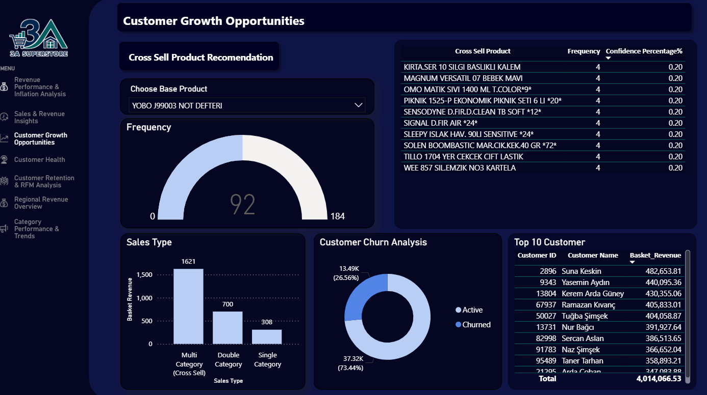

# Müşteri Büyüme Fırsatları

!!! note "Özet"

    Müşteri büyüme fırsatları üç yerde görünür: çapraz satış çiftleri, sepet çeşitliliği ve churn geri kazanımı.

    Çok kategorili sepetler tek kategorili sepetlerden daha güçlü sepet geliri üretir. Bu, müşterileri komşu kategorilere yönlendirmenin sepet değerini artırabileceğini gösterir.

    Dashboard ayrıca müşterilerin yaklaşık dörtte birinin churn olarak işaretlendiğini gösterir. Bu yüzden elde tutma yalnızca savunmacı bir aktivite değil, anlamlı bir büyüme kaldıracıdır.

Dashboard ürün yakınlığını, sepet çeşitliliğini, churn durumunu ve yüksek değerli müşterileri bir araya getirir. Amaç, mevcut müşteri davranışından gelir artırmaya yönelik pratik yollar bulmaktır.

## İş Sorusu

Bu analiz tek bir müşteri büyüme sorusuna odaklanır:

> Geliri artırmak için hangi müşteriler ve sepetler hedeflenebilir?

Yanıt için hangi ürünlerin birlikte alındığı, çok kategorili sepetlerin daha güçlü gelir üretip üretmediği, hangi müşterilerin inaktif olduğu ve hangi müşterilerin halihazırda en çok gelir katkısı verdiği incelendi.

## Kanıtlar Ne Gösteriyor?

-   :lucide-shopping-cart:{ .lg .middle } __Çapraz satış çiftleri belirlenebilir__

    ---

    Aynı siparişte birlikte alınan ürünler; bundle, promosyon veya raf yerleşimi için öneri adayları oluşturur.

-   :lucide-boxes:{ .lg .middle } __Çok kategorili sepetler daha güçlü__

    ---

    Dashboard'da çok kategorili alışverişler en yüksek sepet geliri sinyalini gösterir.

-   :lucide-user-x:{ .lg .middle } __Churn görünür bir fırsat__

    ---

    Dashboard müşterilerin yaklaşık **%26.56**'sını churn olarak işaretler.

-   :lucide-trophy:{ .lg .middle } __En iyi müşteriler korunmalı__

    ---

    En iyi müşteri tablosu, yüksek sepet geliri katkısı olan küçük bir müşteri grubunu öne çıkarır.

## Yöntem

Çapraz satış analizi, aynı sepette birlikte görünen ürünleri belirlemek için sipariş detayı verisini kullanır. Sık satın alınan baz ürünlerden başlar, bunları aynı siparişlerdeki diğer ürünlerle eşleştirir; bir çapraz satış adayının baz ürünle ne kadar sık göründüğünü göstermek için frekans ve confidence hesaplar.

Sepet ve churn analizi; siparişleri, sipariş detaylarını, kategorileri ve müşteri kayıtlarını birleştirir. Sepetleri kategori çeşitliliğine göre segmentler, sepet geliri ve ürün adetlerini hesaplar, müşterileri son siparişlerinden bu yana geçen süreye göre aktif veya churn olarak işaretler.

??? info "Analiz girdileri"

    - `queries/cross_sell_top_20_products.sql`: sık alınan ürünleri bulur, birlikte satın alınan ürünlerle eşleştirir; kombinasyon geliri, frekans ve confidence yüzdesini hesaplar.
    - `queries/basket_customer_churn_analysis.sql`: müşteri churn durumunu sepet geliri, ürün adedi ve kategori çeşitliliği segmentleriyle birleştirir.
    - `notebooks/branch_forecast_and_recommendation_system.ipynb`: en iyi ürünler için çapraz satış adaylarını sıralayan bir öneri sistemi bölümü içerir.

Churn kuralı bilinçli olarak basittir: son siparişinden bu yana 90 günden fazla geçen müşteriler churn olarak işaretlenir. Bu dashboard'u yorumlamayı kolaylaştırır; ileride kategoriye özel satın alma döngüleri veya tahmine dayalı churn modellemesiyle geliştirilebilir.

## Fırsatların Arkasındaki Kanıtlar

### Çapraz satış çiftleri pratik öneri adayları oluşturur

Çapraz satış mantığı aynı siparişte birlikte satın alınan ürünleri belirler. Bu da bundle testleri, promosyon eşleşmeleri veya raf yerleşimi gibi basit öneri fikirleri için kullanışlıdır.

Frekans ve confidence, daha güçlü birlikte satın alma sinyallerini zayıf sinyallerden ayırmaya yardım eder. Sonuçlar tamamlanmış bir öneri motoru değil, test edilecek fırsat adayları olarak ele alınmalıdır.

### Sepet çeşitliliği gelirle bağlantılıdır

Satış tipi grafiği, çok kategorili sepetlerin en güçlü sepet geliri sinyaline sahip olduğunu gösterir. Çift kategorili sepetler tek kategorili sepetlerden daha iyi performans gösterirken, tek kategorili sepetler en düşük katkıyı verir.

Bu net bir büyüme kaldıracına işaret eder: tek kategoriden alışveriş yapan müşterileri ilişkili başka bir kategoriden ürün eklemeye teşvik etmek.

### Churn geri kazanımı anlamlı bir fırsattır

Churn grafiği, müşterilerin yaklaşık dörtte birinin churn olarak işaretlendiğini; çoğunluğun ise aktif kaldığını gösterir.

Bu churn grubunda potansiyel olarak geri kazanılabilir gelir vardır. Her inaktif müşteri geri kazanılamasa bile, onları belirlemek işletmeye reaktivasyon kampanyaları için açık bir hedef sağlar.

### Yüksek değerli müşterilerin korunması gerekir

En iyi müşteri tablosu, en yüksek sepet gelirine sahip müşterileri gösterir. Bu önemlidir çünkü gelir büyümesi yalnızca yeni müşteri kazanımıyla ilgili değildir; halihazırda anlamlı değer üreten müşterileri korumakla da ilgilidir.

Yüksek değerli müşteriler ortalama müşteriye göre daha bilinçli elde tutma aksiyonları almalıdır.

## İş Etkileri

!!! tip "Büyüme çıkarımı"

    En güçlü büyüme fırsatları mevcut davranışı daha akıllıca kullanmaktan gelir: doğal olarak birlikte görünen ürünleri önermek, müşterileri çok kategorili sepetlere yönlendirmek ve inaktifleşen müşterileri geri kazanmak.

Çapraz satış sepet değerini artırabilir, churn geri kazanımı geliri koruyabilir ve yüksek değerli müşteri takibi önlenebilir gelir kaybını azaltabilir. Bunlar tüm iş modelini değiştirmeden test edilebilecek pratik aksiyonlardır.

## Önerilen Aksiyonlar

- Birlikte satın alma çiftlerini bundle testleri, raf yerleşimi ve hedefli promosyonlar için hipotez olarak kullanmak.
- Tek kategorili alıcıları sepet çeşitliliğini artırmak için komşu kategorilere yönlendirmek.
- Churn olarak işaretlenen müşteriler için reaktivasyon kampanyaları kurmak.
- En iyi müşterileri sadakat teklifleri, kişiselleştirilmiş kampanyalar veya öncelikli elde tutma aksiyonlarıyla korumak.
- Her birlikte satın alma çiftinin aynı performansı göstereceğini varsaymak yerine kampanya sonrası çapraz satış confidence'ını ve gelir etkisini izlemek.
- Churn yaklaşımını zaman içinde satın alma sıklığı, ortalama sepet değeri, kategori tercihi ve recency trendleri gibi tahmine dayalı özelliklerle geliştirmek.
