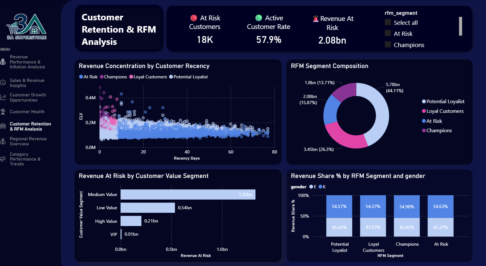

# Müşteri Elde Tutma ve RFM Analizi

!!! note "Özet"

    RFM segmentasyonu, elde tutma çalışmasının önce nereye yönelmesi gerektiğini gösterir.

    Dashboard **18K** At Risk müşteri, **%57.9** Active Customer Rate ve **2.08 milyar** Revenue At Risk belirler. Potential Loyalists en büyük RFM gelir segmentini temsil ederken, Medium Value müşteriler en büyük risk altındaki gelir havuzunu içerir.

    Pratik çıkarım şu: elde tutma yalnızca müşteri sayısına göre değil, davranış ve değer birlikte ele alınarak önceliklendirilmelidir.

Dashboard, müşteri recency'sini, frequency'yi, monetary value'yu, segment bileşimini, risk altındaki geliri ve demografik gelir dağılımını karşılaştırmak için RFM segmentasyonunu kullanır.

## İş Sorusu

Bu analiz bir elde tutma önceliklendirme sorusuna odaklanır:

> Hangi müşteri grupları elde tutma için önceliklendirilmeli ve ne kadar gelir risk altında?

Yanıt için müşteri recency'si, RFM segmenti, müşteri değer segmenti, aktif oran ve risk altındaki gelir karşılaştırıldı.

## Kanıtlar Ne Gösteriyor?

-   :lucide-user-x:{ .lg .middle } __At Risk müşteriler__

    ---

    Dashboard At Risk grubunda **18K** müşteri belirler.

-   :lucide-activity:{ .lg .middle } __Aktif müşteri oranı__

    ---

    Aktif müşteri oranı **%57.9** seviyesindedir.

-   :lucide-badge-alert:{ .lg .middle } __Risk altındaki gelir__

    ---

    At Risk müşteriler yaklaşık **2.08 milyar** risk altındaki geliri temsil eder.

-   :lucide-user-check:{ .lg .middle } __Potential Loyalists gelirde önde__

    ---

    Potential Loyalists **5.78 milyar**, yani RFM gelir payının **%44.11**'ini temsil eder.

## Yöntem

RFM; Recency, Frequency ve Monetary value anlamına gelir. Analiz müşterileri ne kadar yakın zamanda satın aldıklarına, ne kadar sık satın aldıklarına ve ne kadar gelir ürettiklerine göre skorlar.

RFM modeli customer 360 martının üzerine kuruludur. Her müşteri recency, frequency ve monetary value için quintile skorları alır. Bu skorlar bir RFM skorunda birleştirilir ve iş odaklı segmentlere çevrilir:

| Segment | Anlamı |
| --- | --- |
| Champions | Yüksek bağlılık ve yüksek değer gösteren müşteriler. |
| Loyal Customers | Tutarlı satın alma davranışı olan müşteriler. |
| Potential Loyalist | Anlamlı değer veya etkileşime sahip, yukarı taşınabilecek müşteriler. |
| At Risk | Daha zayıf etkileşim ve daha yüksek elde tutma riski gösteren müşteriler. |

??? info "Kullanılan dbt modelleri"

    - `mart_customer_360`: yaşam boyu gelir, sipariş sayısı, recency, tenure, aktif aylar, ortalama sipariş değeri, değer segmenti ve yaşam döngüsü aşaması içeren müşteri seviyesinde temel tablo.
    - `mart_customer_rfm`: recency, frequency ve monetary quintile skorları, birleşik RFM skoru, toplam skor ve RFM segment etiketi ekler.

## Sonucun Arkasındaki Kanıtlar

### Recency değer yoğunlaşmasıyla bağlantılı

Recency scatter plot, müşteri yaşam boyu değerini son siparişten bu yana geçen günle karşılaştırır. Yakın zamanda sipariş veren müşterilerde daha güçlü değer yoğunlaşması görülürken son siparişinden daha uzak müşteriler genellikle daha düşük seviyelerde konumlanır.

Bu recency'nin değerin tek sürücüsü olduğu anlamına gelmez; fakat recency'yi önemli bir elde tutma sinyali yapar. Değerli olup yakın zamanda sipariş vermemiş müşteriler, gelirleri geri kazanılması zor hale gelmeden önce dikkat gerektirir.

### Potential Loyalists en büyük RFM gelir segmentidir

RFM segment bileşimi grafiği Potential Loyalists'i 5.78 milyar ve %44.11 RFM gelir payı ile en büyük gelir segmenti olarak gösterir.

Bu segment büyük bir büyüme fırsatıdır. Potential Loyalists'in bir bölümünü bile Loyal Customer veya Champion davranışına taşımak anlamlı gelir etkisi yaratabilir.

### Medium Value müşteriler en büyük risk altındaki gelir bloğunu taşır

Risk altındaki gelir grafiği, Medium Value müşterilerin yaklaşık 1.33 milyar ile en büyük risk bloğunu oluşturduğunu gösterir. Low Value müşteriler yaklaşık 0.54 milyar, High Value müşteriler yaklaşık 0.21 milyar ve VIP müşteriler yaklaşık 0.01 milyar ile takip eder.

Bu, elde tutmanın yalnızca en yüksek değer etiketine odaklanmaması gerektiğini gösterir. Medium Value müşteriler yeterli gelir ölçeğine sahip oldukları için bu grupta churn önleme daha büyük toplam etki üretebilir.

### Cinsiyet ana segmentasyon sürücüsü gibi görünmüyor

RFM segmenti ve cinsiyete göre gelir payı grafiği segmentler arasında görece dengelidir.

Bu, elde tutma stratejisinin öncelikle recency, frequency, monetary value ve değer segmenti gibi davranışsal segmentasyonları kullanması gerektiğini gösterir. Cinsiyet ikincil bağlam olarak faydalı olabilir, fakat bu dashboard'da görünen ana sürücü değildir.

## İş Etkileri

!!! tip "Elde tutma çıkarımı"

    Her elde tutma çalışmasının beklenen getirisi aynı değildir. En güçlü hedefler, anlamlı değeri zayıflayan etkileşim sinyalleriyle birleştiren müşterilerdir.

At Risk müşteriler acil gelir korumasını temsil eder. Potential Loyalists büyüme potansiyelini temsil eder. Medium Value At Risk müşteriler ise riski ölçekle birleştirdikleri için özel dikkat gerektirir.

## Önerilen Aksiyonlar

- İnaktivite kalıcı hale gelmeden önce At Risk müşterileri hedefli kampanyalarla yeniden aktive etmek.
- At Risk grubu içinde Medium Value müşterileri önceliklendirmek; çünkü en büyük risk altındaki gelir havuzunu taşırlar.
- Potential Loyalists'i tekrar satın alma ve sadakat kampanyalarıyla Loyal Customer davranışına yaklaştırmak.
- Champions müşterileri kişiselleştirilmiş elde tutma, takdir veya yüksek değerli sadakat uygulamalarıyla korumak.
- Önce davranışsal segmentasyonu kullanmak, demografik kırılımları ikincil bağlam olarak ele almak.
- Zaman içinde recency, frequency, monetary value, kategori davranışı ve satın alma zamanlamasını kullanarak tahmine dayalı churn modellemesi eklemek.
