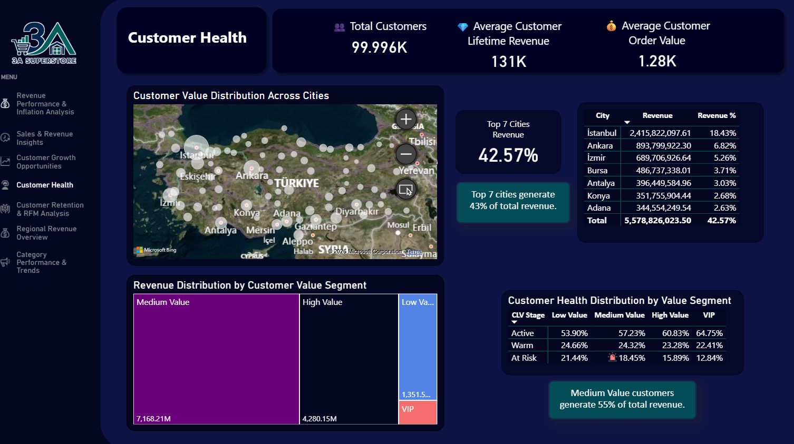

# Müşteri Sağlığı

!!! note "Özet"

    Müşteri değeri coğrafi olarak ve değer segmentleri içinde yoğunlaşmış durumda.

    İlk yedi şehir toplam gelirin **%42.57**'sini üretir ve Medium Value müşteriler en büyük gelir payını taşır. Bu, Medium Value müşterileri yakın vadeli elde tutma ve upsell fırsatları için izlenmesi gereken en önemli grup yapar.

    Müşteri değeri arttıkça müşteri sağlığı da iyileşir: VIP müşteriler en yüksek Active oranına sahipken Low Value müşteriler en yüksek At Risk payını gösterir.

Dashboard müşteri değerini, coğrafyayı, yaşam döngüsü aşamasını ve gelir yoğunlaşmasını birleştirir. Müşteri değerinin nerede üretildiğini ve gelir kaybı yaşanmadan önce hangi müşteri gruplarının dikkat gerektirdiğini belirlemeye yardımcı olur.

## İş Sorusu

Bu analiz bir müşteri portföyü sorusuna odaklanır:

> Müşteri değeri nerede yoğunlaşıyor ve hangi müşteri grupları elde tutma açısından dikkat gerektiriyor?

Yanıt için müşteri yaşam boyu geliri, değer segmentleri, yaşam döngüsü aşamaları, şehir seviyesinde gelir yoğunlaşması ve değer segmentine göre sağlık dağılımı incelendi.

## Kanıtlar Ne Gösteriyor?

-   :lucide-users:{ .lg .middle } __Geniş müşteri tabanı__

    ---

    Dashboard yaklaşık **99.996K** müşteriyi takip eder.

-   :lucide-gem:{ .lg .middle } __Yüksek ortalama müşteri değeri__

    ---

    Ortalama müşteri yaşam boyu geliri yaklaşık **131K**, ortalama sipariş değeri yaklaşık **1.28K** seviyesindedir.

-   :lucide-map-pin:{ .lg .middle } __Gelir coğrafi olarak yoğunlaşmış__

    ---

    İlk yedi şehir toplam gelirin **%42.57**'sini üretir.

-   :lucide-shield-alert:{ .lg .middle } __Sağlık değer segmentine göre değişiyor__

    ---

    VIP müşteriler en güçlü Active oranına sahipken Low Value müşteriler en yüksek At Risk payına sahiptir.

## Yöntem

Müşteri sağlığı analizi, her müşterinin satın alma geçmişini ve yaşam döngüsü durumunu özetleyen müşteri seviyesinde bir mart üzerine kuruludur.

Model müşteri yaşam boyu gelirini, toplam sipariş sayısını, tenure'ı, recency'yi, aktif ayları, ortalama sipariş değerini, ortalama sepet adedini, tekrar eden müşteri bayraklarını, değer segmentini ve yaşam döngüsü aşamasını hesaplar.

Değer segmentleri müşteri yaşam boyu gelirine dayanır:

- Low Value
- Medium Value
- High Value
- VIP

Yaşam döngüsü aşamaları veri setindeki en son sipariş tarihine göre recency üzerinden tanımlanır:

| Aşama | Anlamı |
| --- | --- |
| Active | Çok yakın zamanda satın alma aktivitesi olan müşteriler. |
| Warm | Aktivitesi yavaşlamış ama henüz yüksek riskli hale gelmemiş müşteriler. |
| At Risk | Son siparişinin üzerinden en uzun süre geçmiş müşteriler. |

??? info "Kullanılan dbt modeli"

    - `mart_customer_360`: yaşam boyu gelir, toplam sipariş, tenure, recency, aktif aylar, ortalama sipariş değeri, sepet adedi, tekrar eden/yüksek değerli müşteri bayrakları, değer segmenti ve yaşam döngüsü aşaması içeren müşteri başına bir satırlık model.
    - `int_orderdetail_order_customer_enriched`: müşteri martı agreglenmeden önce sipariş satırlarını müşteri profil alanları ve müşteri seviyesinde sipariş davranışıyla zenginleştirir.

## Sonucun Arkasındaki Kanıtlar

### Müşteri değeri büyük şehirlerde yoğunlaşıyor

Coğrafi görünüm Türkiye genelinde gelir yoğunlaşmasını gösterir. Şehir tablosunda İstanbul en büyük payla öndedir; onu Ankara, İzmir, Bursa, Antalya, Konya ve Adana izler.

İlk yedi şehir birlikte toplam gelirin %42.57'sini üretir. Bu yoğunlaşma bölgesel kampanyaları hedeflemek için faydalıdır; fakat işletmenin sınırlı sayıda yüksek performanslı şehre bağımlılığını da izlemesi gerekir.

### Medium Value müşteriler en büyük gelir payını taşıyor

Gelir dağılımı treemap'i, Medium Value müşterilerin en büyük gelir bloğunu ürettiğini gösterir; dashboard notu bu grubun toplam gelirin yaklaşık %55'ini oluşturduğunu vurgular.

Bu, Medium Value müşterileri özellikle önemli kılar. Toplam geliri hareket ettirecek kadar büyüklerdir ve genellikle elde tutma ile üst segmente çıkarma kampanyaları için en iyi yakın vadeli hedeftirler.

### Müşteri sağlığı değerle birlikte iyileşiyor

Sağlık dağılımı tablosu değer segmentleri arasında net bir örüntü gösterir. Active oranı Low Value'dan VIP'e doğru yükselirken At Risk payı müşteri değeri arttıkça düşer.

Low Value müşteriler en yüksek At Risk payını gösterir. VIP müşteriler en güçlü Active oranına sahiptir. Medium Value müşteriler ortada yer alır; ancak en büyük gelir payını ürettikleri için bu gruptaki orta seviyeli sağlık bozulması bile önemli olabilir.

## İş Etkileri

!!! tip "Elde tutma çıkarımı"

    En yüksek etkili elde tutma çalışması yalnızca en riskli müşterilerle ilgili değildir. Anlamlı gelir taşıyan segmentlerin içindeki en riskli müşterilerle ilgilidir.

Medium Value müşteriler ölçek ile üst segmente çıkma potansiyelini birleştirdikleri için yakından izlenmelidir. VIP müşteriler daha sağlıklı görünür, ancak bireysel değerleri yüksek olduğu için yine de korunmalıdır. Daha düşük değerli müşteriler pahalı bire bir elde tutma yerine daha düşük maliyetli ve otomatik etkileşim gerektirebilir.

## Önerilen Aksiyonlar

- Medium Value müşterilerin Active durumundan Warm veya At Risk durumuna geçişini izlemek.
- Özellikle gelir ağırlığı yüksek segmentlerdeki At Risk müşteriler için hedefli elde tutma kampanyaları başlatmak.
- Medium Value müşterileri High Value ve VIP davranışına taşıyacak upgrade yolları oluşturmak.
- VIP müşterileri kişiselleştirilmiş sadakat ve hizmet aksiyonlarıyla korumak.
- En yüksek gelir üreten şehirlerin dışında bölgesel büyüme stratejileri geliştirmek.
- Zaman içinde tahmine dayalı churn takibi ekleyerek müşteri sağlığını müşteriler At Risk olmadan önce tespit etmek.
