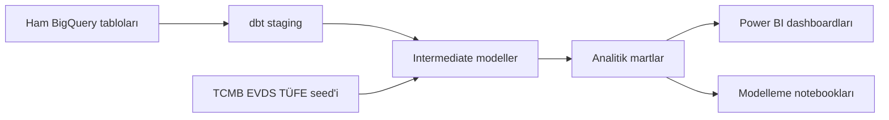

  

# 3A Superstore Analitik Projesi

3A Superstore Analytics, perakende işlem verisi üzerinde hazırlanmış bir ekip veri analitiği projesidir. Projede satışları, enflasyona göre düzeltilmiş gelir performansını, müşteri davranışını, kategori trendlerini, bölgesel yoğunlaşmayı ve elde tutma fırsatlarını analiz etmek için BigQuery, dbt, Python notebookları ve Power BI kullanıldı.

!!! note "Proje çıkarımı"

    Veri seti Türkiye'de yüksek enflasyon yaşanan bir dönemdeki perakende satışlarını kapsadığı için nominal satışlar yanıltıcı olabilir. Proje, nominal ve reel geliri karşılaştırmak için işlem verisini [TCMB EVDS](https://evds3.tcmb.gov.tr) TÜFE verisiyle birleştirir; ardından sonucu sipariş, müşteri, adet ve ürün fiyatı sinyalleriyle kontrol eder.

## Analiz Portföyü

Her analiz sayfası farklı bir iş sorusuna odaklanır ve bir ekip üyesi tarafından sahiplenilir.

-   :lucide-turkish-lira:{ .lg .middle } __[Gelir Performansı ve Enflasyon Analizi](analizler/gelir-performansi-enflasyon.md)__

    ---

    Nominal ve reel gelir, TÜFE düzeltmesi, ürün fiyatı doğrulaması ve enflasyon duyarlı KPI'lar.

    _Yazar: Doruk Alkan_

-   :lucide-wallet:{ .lg .middle } __[Satış ve Gelir İçgörüleri](analizler/satis-gelir-icgoruleri.md)__

    ---

    Satış trendleri, sipariş hacmi, coğrafi gelir örüntüleri ve gelir tahmini.

    _Yazar: Ebubekir Tilbaç_

-   :lucide-shopping-cart:{ .lg .middle } __[Müşteri Büyüme Fırsatları](analizler/musteri-buyume-firsatlari.md)__

    ---

    Çapraz satış fırsatları, churn sinyalleri, sepet çeşitliliği ve yüksek değerli müşteriler.

    _Yazar: Ebubekir Tilbaç_

-   :lucide-shield-plus:{ .lg .middle } __[Müşteri Sağlığı](analizler/musteri-sagligi.md)__

    ---

    Müşteri değer segmentasyonu, sağlık aşamaları, coğrafi değer yoğunlaşması ve elde tutma öncelikleri.

    _Yazar: Yasemen Dündar_

-   :lucide-user-search:{ .lg .middle } __[Müşteri Elde Tutma ve RFM Analizi](analizler/musteri-elde-tutma-rfm.md)__

    ---

    RFM segmentasyonu, aktif müşteri oranı, risk altındaki gelir ve elde tutma stratejisi.

    _Yazar: Yasemen Dündar_

-   :lucide-map-pin:{ .lg .middle } __[Bölge ve Kategori Performansı](analizler/bolge-kategori-performansi.md)__

    ---

    Bölgesel gelir yoğunlaşması ve kategori katkısının coğrafyaya göre değişimi.

    _Yazar: Eda Bilgin_

-   :lucide-shopping-basket:{ .lg .middle } __[Kategori Trendleri](analizler/kategori-trendleri.md)__

    ---

    Kategori geliri, satış adedi, sipariş aktivitesi ve kategori karışımının zaman içindeki istikrarı.

    _Yazar: Eda Bilgin_

## Teknik Uygulama

dbt projesi katmanlı bir model yapısıyla düzenlendi:

- Staging modelleri siparişler, sipariş detayları, müşteriler, şubeler, kategoriler ve TÜFE için ham BigQuery tablolarını temizler.
- Intermediate modelleri sipariş geliri, şube boyutları, aylık TÜFE metrikleri ve ürün-ay fiyatlaması gibi yeniden kullanılabilir analitik mantıkları oluşturur.
- Mart modelleri gelir trendleri, KPI kartları, ürün fiyat trendleri, kategori fiyat hareketleri, şube geliri, müşteri 360 ve RFM analizi için dashboard'a hazır tablolar üretir.
- Özel dbt testleri grain, mutabakat, TÜFE matematiği, dönem pencereleri ve dashboard KPI hesaplamalarını doğrular.

Mevcut dbt grafiği parse edildikten sonra 26 model, 1 seed ve 189 test içerir.

## Kullanılan Araçlar

| Araç | Rol |
| --- | --- |
| BigQuery | Veri ambarı, SQL keşfi, ham tablo saklama ve analitik çıktılar. |
| dbt | Dönüşüm modellemesi, dokümantasyon ve otomatik veri testleri. |
| Python, Jupyter, Google Colab | Keşifsel analiz, doğrulama ve tahmin denemeleri. |
| Power BI | Final dashboardları ve iş odaklı görsel analiz. |
| Zensical | Herkese açık proje sitesi ve portföy dokümantasyonu. |

## Proje Bağlantıları

-   :octicons-database-24:{ .lg .middle } __[Veri Seti](hakkinda/veri-seti.md)__

    ---

    Kaynak veri seti, ham tablo özeti, Kaggle atfı ve TÜFE ek verisi notları.

-   :lucide-users:{ .lg .middle } __[Ekip](hakkinda/ekip.md)__

    ---

    Ekip üyeleri, sahiplik alanları ve proje odakları.

-   :fontawesome-brands-github:{ .lg .middle } __[GitHub Deposu](https://github.com/dorukalkan/3a-superstore-analysis)__

    ---

    Kaynak kod, dbt modelleri, notebooklar, sorgu arşivi ve Zensical site dosyaları.

