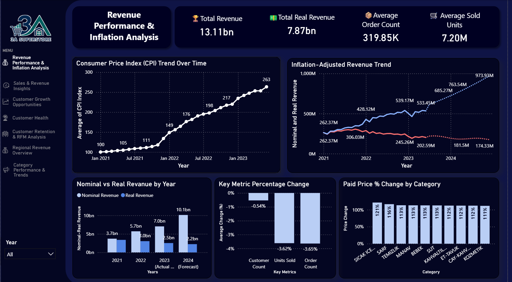

# Revenue Performance & Inflation Analysis

!!! note "Summary"

    3A Superstore collected more Turkish lira over time, but earned less in real purchasing-power terms.

    Nominal revenue looked stronger because prices and CPI increased sharply. After inflation adjustment, the business story changed: real revenue weakened, while orders and units sold did not show enough growth to explain the nominal increase.

    The main takeaway is simple: in a high-inflation market, nominal revenue is not enough. Revenue should be evaluated together with real revenue, volume, and price-adjusted KPIs.



The dashboard summarizes the inflation story from several angles: CPI trend, nominal vs. real revenue, annual revenue comparison, customer/order/unit changes, and product-level price increases.

## Business Question

This analysis focuses on one core question:

> Did 3A Superstore's revenue actually grow, or did nominal growth mainly reflect inflation-driven price increases?

The dataset covers a Turkish supermarket chain over a high-inflation period. In that context, looking only at nominal revenue can be misleading. A business may appear to be growing because the amount of money collected at checkout increases, while the real purchasing power of that revenue declines.

To separate these effects, I compared nominal revenue, inflation-adjusted real revenue, customer/order/unit volume, and realized product price changes.

## What the Evidence Shows

<div class="grid cards" markdown>

-   :lucide-trending-up:{ .lg .middle } __Nominal revenue rose__

    ---

    Total nominal revenue reached approximately **13.11bn TRY** during the analysis period.

-   :lucide-chart-no-axes-column-decreasing:{ .lg .middle } __Real revenue weakened__

    ---

    After CPI adjustment, total real revenue was approximately **7.87bn TRY**, showing weaker purchasing-power performance.

-   :lucide-shopping-basket:{ .lg .middle } __Volume did not explain growth__

    ---

    Units sold and order count declined by around **3.6%**.

-   :lucide-tags:{ .lg .middle } __Prices moved sharply__

    ---

    Product-level paid prices increased substantially, with several major categories showing price increases above **100%**.

</div>

## Methodology

The analysis uses monthly CPI data from TCMB EVDS[^evds] and joins it to monthly revenue aggregates created in dbt.

The CPI series is an index, so the original 2003 baseline is not directly meaningful for this business question. What matters is the ratio between CPI levels. In the dashboard, January 2021 is used as the base period. This makes the first month of the analysis equal for nominal and real revenue, then shows how the two series diverge over time.

```text
real_revenue = nominal_revenue * CPI_base_month / CPI_current_month
```

The modeled workflow follows this structure:

1. Clean and standardize raw order and order-detail tables.
2. Aggregate order-level revenue into monthly revenue.
3. Prepare monthly CPI metrics and January 2021 adjustment factors.
4. Convert nominal revenue into inflation-adjusted real revenue.
5. Create dashboard-ready revenue marts.
6. Validate the revenue story with volume metrics and item/category price changes.

??? info "dbt models used"

    - `fct_monthly_revenue`: monthly nominal revenue, real revenue, CPI metrics, order count, customer count, units sold, and January 2021 revenue indexes.
    - `mart_revenue_trend_monthly`: dashboard trend table for nominal revenue, real revenue, and CPI index.
    - `mart_revenue_story_kpis`: January 2021 vs. June 2023 KPI comparison for revenue, CPI, orders, units, and customers.
    - Product price marts: paid-price trend and category price movement tables used to validate whether nominal growth was price-driven.

## Evidence Behind the Conclusion

### Nominal revenue rose, but real revenue declined

Across the analysis period, total nominal revenue reached approximately 13.11bn TRY. However, after inflation adjustment, total real revenue was approximately 7.87bn TRY.

This shows that the business collected more money in nominal terms, but that money represented significantly less purchasing power after accounting for inflation.

The main trend chart shows this clearly: nominal revenue follows an upward path, while inflation-adjusted revenue declines over time. In other words, revenue appears to grow on paper, but its real economic value erodes.

### CPI pressure was large enough to change the interpretation

The CPI index rose dramatically over the analysis period, reaching roughly 263 on the dashboard's January 2021 = 100 scale. This means the general price level rose by more than 160% relative to the start of the dataset.

This inflationary environment is the main reason nominal revenue alone is not enough to evaluate performance. If the business only tracks current-price sales, it can mistake price-level growth for real business growth.

### Orders and units did not support a volume-growth story

To check whether nominal revenue growth came from actual business expansion, I compared customer count, order count, and units sold.

The result was not consistent with strong volume growth:

- Customer count changed only slightly.
- Units sold and order count both declined by around 3.6%.

This means the nominal revenue increase was not mainly driven by more customers, more orders, or more units sold. The volume side of the business remained broadly stable or slightly weaker.

### Product prices validated the inflation explanation

The item-level analysis supports the inflation hypothesis. Across thousands of products, realized paid prices increased substantially over the period.

The dashboard shows average paid price increases above 100% across major product categories. For example, hot beverages showed one of the highest increases, at around 121%, while several other categories such as cleaning, produce, baby products, and dairy also showed strong price growth.

This helps explain why nominal revenue increased despite weak volume growth: the business was selling products at higher nominal prices, but those higher prices did not translate into stronger real revenue.

## Business Implications

!!! tip "Management takeaway"

    3A Superstore's revenue growth was largely inflation-driven rather than volume-driven.

    In other words, the supermarket collected more TRY over time, but earned less in real purchasing-power terms.

    If management only tracks nominal revenue, the business may appear healthier than it really is. Real revenue, real average order value, volume, and price-adjusted KPIs provide a more reliable view of business health in a high-inflation market.

## Recommended Actions

The main strategic implication is that revenue growth needs to be evaluated against inflation, not just against previous nominal sales.

To protect real revenue, the business would need to pursue strategies that generate growth above inflation, such as:

- monitoring real revenue and real average order value as standard KPIs,
- comparing nominal growth against CPI before calling it business growth,
- improving customer retention and purchase frequency,
- increasing basket value through targeted promotions,
- optimizing product mix toward higher-margin or more resilient categories,
- investigating weaker regions and branches through the regional dashboards.

For high-inflation markets, nominal revenue should not be treated as the primary success metric. Real revenue, volume, and price-adjusted KPIs provide a more reliable view of business health.

[^evds]: TCMB EVDS is the Electronic Data Delivery System of the Central Bank of the Republic of Türkiye. It provides access to official economic time series, including CPI data. See the [EVDS portal](https://evds3.tcmb.gov.tr) and [EVDS documentation](https://evds3.tcmb.gov.tr/dokumanlar) for API and usage details.
