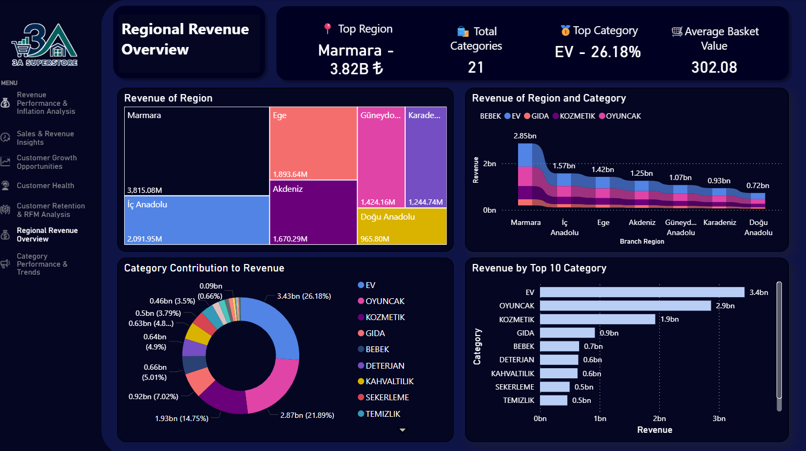

# Revenue and Category Performance Analysis

## Overview

This project analyzes revenue performance, category trends, and inflation-adjusted business metrics using Power BI dashboards. The objective is to understand how revenue is distributed across regions and product categories, identify key business drivers, and evaluate sales performance over time.

---

# Regional Revenue Overview

## Dashboard Objective

The Regional Revenue Overview dashboard provides a high-level view of revenue distribution across regions and product categories. It helps identify the strongest markets, the most profitable categories, and the overall revenue structure of the business.

## KPI Summary

### Nominal Revenue
Total revenue generated during the analysis period without adjusting for inflation.

### Real Revenue
Inflation-adjusted revenue that reflects the actual purchasing power of generated sales.

### Average Customer Count
Average number of customers served throughout the analysis period.

### Average Order Count
Average number of orders processed during the period.

### Average Units Sold
Average quantity of products sold across all transactions.

## Visual Analysis

### Revenue by Branch Region

The treemap visualizes revenue contribution by region. Larger rectangles indicate regions generating higher revenue. Marmara stands out as the strongest-performing region within the business.

### Revenue by Branch Region and Category

The regional-category comparison chart shows how product categories contribute to revenue across different regions. This analysis highlights regional purchasing behavior and category preferences.

### Category Contribution to Revenue

The donut chart displays the percentage share of total revenue generated by each category. It allows quick identification of the categories that contribute most significantly to business performance.

### Revenue by Top Categories

The horizontal bar chart ranks categories according to their revenue contribution. This visualization highlights the most profitable product groups and reveals revenue concentration across categories.

## Key Insights

- Marmara is the leading revenue-generating region.
- Revenue distribution varies considerably between regions.
- A small number of categories account for a large share of total revenue.
- Customer purchasing preferences differ across regions.

---

# Category Performance & Trends

## Dashboard Objective

This dashboard focuses on category-level performance by examining the relationship between revenue, sales quantity, and order activity. It aims to identify the factors driving business growth and category success.

## Visual Analysis

### Revenue vs Sales Volume by Category

The bubble chart compares category revenue and sales quantity. Categories with higher sales volumes generally generate higher revenue, indicating a strong positive relationship between demand and financial performance.

### Total Quantity vs Total Order Count by Month

This combined chart tracks monthly product quantities sold alongside order counts. The parallel movement of both metrics suggests consistent customer purchasing behavior throughout the period.

### Revenue Trend by Category Composition

The stacked percentage chart shows how category contributions evolve over time. The relatively stable composition indicates that customer preferences remained consistent and no major category shifts occurred.

## Key Insights

- Categories with higher sales volumes tend to generate higher revenue.
- Order count and quantity sold move in a similar pattern over time.
- Category contribution remains relatively stable throughout the analysis period.
- Revenue growth appears to be driven primarily by sales activity rather than major changes in category composition.

---

# Overall Business Findings

Combining both dashboards provides a comprehensive view of business performance.

Regional analysis reveals where revenue is generated, while category analysis explains what drives that revenue. The findings indicate that business performance is largely supported by stable customer purchasing behavior, strong category demand, and consistent sales activity.

Marmara remains the dominant revenue contributor, while a limited number of categories generate a substantial portion of overall revenue.

## Conclusion

The analysis demonstrates that revenue performance is influenced by both regional dynamics and category-level demand. Business growth appears to be primarily driven by sales volume and operational activity rather than significant shifts in category distribution. These insights can support future decisions related to regional expansion, category management, and revenue optimization strategies.
