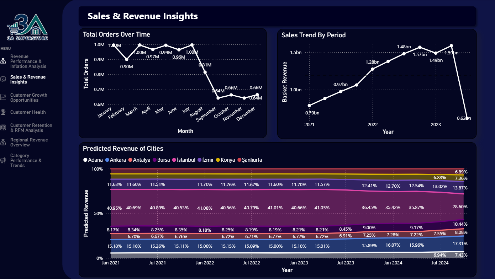

# Sales & Revenue Insights

!!! note "Summary"

    Sales activity is not flat across the year. Order volume is relatively stable in the first half, then drops sharply after summer.

    Revenue shows a strong upward trend across the main historical period, but the final visible decline should be interpreted carefully because it may reflect incomplete or less reliable period coverage rather than a confirmed business collapse.

    The city forecast suggests that major metropolitan markets remain the core revenue base, so regional planning should focus on protecting high-contribution cities while investigating weaker markets.

The dashboard combines historical sales patterns with city-level revenue forecasting. It helps answer where revenue is concentrated, how order activity changes over time, and which cities are expected to remain important for future sales planning.

## Business Question

This analysis focuses on a practical planning question:

> How do sales and revenue move over time, and which cities are expected to drive future revenue?

To answer this, the analysis looks at monthly order behavior, revenue trend by period, and forecasted city-level revenue shares.

## What the Evidence Shows

-   :lucide-calendar-days:{ .lg .middle } __Orders soften after summer__

    ---

    Monthly order volume is close to 1.0M early in the year, then falls sharply after August.

-   :lucide-trending-up:{ .lg .middle } __Revenue grows through the main period__

    ---

    Revenue rises from roughly **0.79bn** in 2021 to peaks above **1.5bn** in the later period.

-   :lucide-map-pin:{ .lg .middle } __City revenue is concentrated__

    ---

    İstanbul carries the largest projected share, with Ankara and İzmir remaining important contributors.

-   :lucide-line-chart:{ .lg .middle } __Forecasts support planning__

    ---

    The Prophet forecast gives a directional view of city revenue mix for regional planning and resource allocation.

## Methodology

The historical trend analysis is based on order-level revenue joined to cleaned branch geography. The SQL logic derives time and location fields such as year, month, weekday/weekend, season, branch region, branch city, total orders, total revenue, and average basket value.

The forecasting work uses the branch forecast notebook. It selects the top revenue cities, removes incomplete periods before modeling, fits a Prophet model for each city, includes Turkish holidays, and exports forecasted city revenue back to BigQuery for dashboard use.

??? info "Analysis inputs"

    - `queries/time_trends.sql`: builds the time-trend dataset with month, season, weekday/weekend, region, city, order count, revenue, and average basket value.
    - `notebooks/branch_forecast_and_recommendation_system.ipynb`: fits city-level Prophet forecasts for the top revenue cities and prepares forecast output for BigQuery.
    - `prophet_branch_forecasts`: forecast output table used for projected city revenue views.

The forecast should be read as planning support, not as a guaranteed prediction. It is useful for directional regional planning, but it would be stronger with more validation and external demand drivers.

## Evidence Behind the Conclusion

### Order volume is seasonal

The monthly order chart shows that order volume remains relatively stable during the first half of the year. It then drops sharply after August, reaching the lowest levels around September through November before stabilizing again toward December.

This pattern matters operationally. If order demand softens later in the year, inventory, staffing, and campaign planning should not assume the same demand level across every month.

### Revenue increased over the main historical period

The revenue trend shows strong growth from 2021 into the later periods, with revenue rising from roughly 0.79bn to peaks above 1.5bn.

The final point drops sharply. That should not be overread without checking period completeness, because partial data can make the most recent period look weaker than the business actually is.

### Major cities remain the revenue base

The forecasted city revenue view shows that İstanbul has the largest projected share. Ankara and İzmir also remain important, while Antalya, Bursa, Konya, Şanlıurfa, and Adana contribute to the remaining mix.

This means regional planning should treat major cities as the core revenue base, while still monitoring whether smaller markets are gaining or losing share.

## Business Implications

!!! tip "Planning takeaway"

    The business should not plan sales operations from annual totals alone. Monthly demand patterns and city-level concentration matter for inventory, staffing, campaign timing, and regional investment.

The sales story has two sides: revenue growth looks strong over the main historical period, but order volume shows seasonal softness and the forecast remains concentrated in a few cities. That combination suggests a need for both demand planning and regional risk monitoring.

## Recommended Actions

- Investigate why order volume drops after summer and whether the pattern is seasonal, promotional, operational, or data-related.
- Align inventory and workforce planning with the lower-demand months instead of using a flat monthly assumption.
- Prioritize campaigns and service quality in İstanbul, Ankara, and İzmir because they remain major revenue contributors.
- Monitor smaller cities for growth opportunities so the business does not become too dependent on a small number of markets.
- Improve the forecast with additional drivers such as campaign periods, holidays, local events, inflation, and validation against holdout periods.
