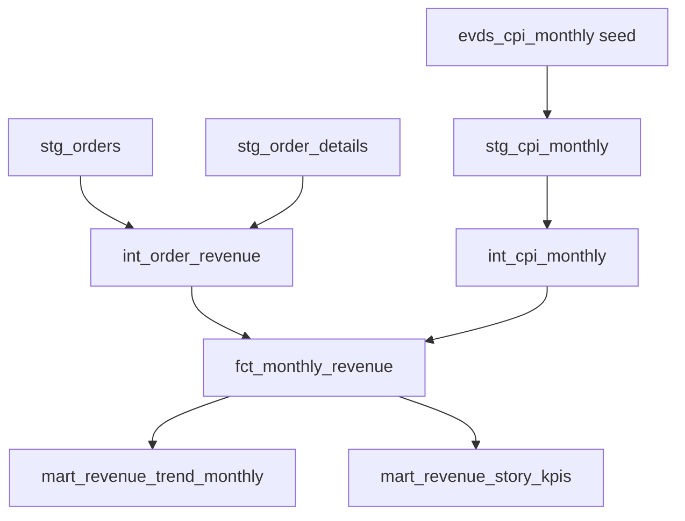

# CPI Revenue Models

This model path answers a narrow question first:

> What does monthly sales revenue look like before and after adjusting for
> inflation?

The source seed, `evds_cpi_monthly`, stores monthly TCMB EVDS CPI index levels
from series `TP.FG.J0`. The CPI values use the EVDS `2003=100` baseline. That
baseline is useful for identifying the source series, but it is not itself a
revenue metric. Real revenue comes from ratios between CPI index levels.

The current path is:



## Why Monthly

The CPI seed is monthly, so the first CPI-adjusted revenue mart is monthly too.
`fct_monthly_revenue` is a simple topline table for line charts such as:

- `order_month` vs `nominal_revenue`
- `order_month` vs `real_revenue`
- `order_month` vs `nominal_revenue_index_jan_2021_100`
- `order_month` vs `real_revenue_index_jan_2021_100`
- `order_month` vs `cpi_index_jan_2021_100`

The existing daily branch revenue mart remains nominal. We do not invent daily
CPI values from a monthly CPI seed. A future branch-level real revenue mart
should aggregate revenue to a monthly branch grain first, then join monthly CPI.

January 2021 is the constant-TRY reporting month. It is the first sales month
in the dataset, so indexed growth charts can start nominal and real revenue at
the same value and then show how they diverge over time. The sales data includes
only a partial August 2023, so August remains in the mart but should not be
treated as a full-month trend comparison without that caveat.

For dashboard presentation, the focused mart window is January 2021 through
June 2023. June 2023 is the default comparison month for the headline story.
This avoids using the late-2023 months as headline trend endpoints while still
leaving the full monthly fact available for deeper analysis.

## `stg_cpi_monthly`

`stg_cpi_monthly` is the staging layer for the CPI seed. It keeps the seed close
to its source shape and only makes the fields safe to use downstream:

```sql
select
    date_trunc(cast(cpi_month as date), month) as cpi_month,
    cast(cpi_index_2003_100 as numeric) as cpi_index_2003_100,
    cast(source_series_code as string) as source_series_code
from {{ ref('evds_cpi_monthly') }}
```

The model grain is one row per CPI month.

The important columns are:

| Column | Meaning |
| --- | --- |
| `cpi_month` | First day of the CPI month, used as the join key. |
| `cpi_index_2003_100` | The monthly CPI index level from EVDS. |
| `source_series_code` | The EVDS source series code, currently `TP.FG.J0`. |

The stage does not calculate inflation rates or real revenue. Its job is to
give downstream models a typed and documented CPI source.

## `int_cpi_monthly`

`int_cpi_monthly` turns CPI index levels into CPI metrics that revenue models
can use.

It starts from `stg_cpi_monthly`, finds the January 2021 CPI index level once,
and adds that base index to every row:

```sql
max(
    case
        when cpi_month = date '2021-01-01'
        then cpi_index_2003_100
    end
) over () as base_cpi_index_2003_100
```

It then joins each CPI month to:

- the prior CPI month, for month-over-month inflation
- the same month one year earlier, for year-over-year inflation

The rate calculations are:

```text
cpi_mom_rate = current_month_cpi / prior_month_cpi - 1
cpi_yoy_rate = current_month_cpi / prior_year_cpi - 1
```

For example, the seed contains:

| CPI month | CPI index |
| --- | ---: |
| 2023-06-01 | 1351.59 |
| 2023-07-01 | 1479.84 |

July 2023 MoM CPI change is therefore approximately:

```text
1479.84 / 1351.59 - 1 = 0.094888
```

That is about `9.49%`.

The real revenue adjustment uses the January 2021 CPI index as the reporting
base:

```text
inflation_adjustment_factor = CPI_January_2021 / CPI_revenue_month
```

For January 2021, the seed has CPI index `513.30`, so the factor is:

```text
513.30 / 513.30 = 1
```

This means January 2021 nominal and real revenue match in the first month of
the sales series.

For July 2023, the seed has CPI index `1479.84`. The January 2021 factor is
approximately:

```text
513.30 / 1479.84 = 0.346866
```

This means `100` nominal TRY in July 2023 is represented as roughly `34.7`
January 2021 TRY for constant-price comparison.

The model also exposes a cumulative CPI price-level index with the same January
2021 base:

```text
cpi_index_jan_2021_100 = CPI_revenue_month / CPI_January_2021 * 100
```

This index starts at `100` in January 2021 and rises as the price level rises.
It is better suited to indexed revenue charts than `cpi_mom_rate`, which is a
monthly percentage change instead of a cumulative price-level series.

The month-over-month and year-over-year rate columns are null when the required
comparison CPI row is not available in the CPI model.

## `fct_monthly_revenue`

`fct_monthly_revenue` is the first CPI-adjusted revenue mart. Its grain is one
row per `order_month`.

The model first aggregates order-grain revenue from `int_order_revenue`:

```sql
select
    order_month,
    count(*) as order_count,
    count(distinct customer_id) as customer_count,
    sum(nominal_order_revenue) as nominal_revenue,
    sum(line_nominal_revenue) as line_nominal_revenue,
    sum(units_sold) as units_sold,
    sum(line_item_count) as line_item_count
from {{ ref('int_order_revenue') }}
group by order_month
```

It then joins `int_cpi_monthly` on the monthly key:

```sql
on monthly_revenue.order_month = cpi.cpi_month
```

Finally, it applies the CPI adjustment factor:

```text
real_revenue = nominal_revenue * inflation_adjustment_factor
line_real_revenue = line_nominal_revenue * inflation_adjustment_factor
real_avg_order_value = nominal_avg_order_value * inflation_adjustment_factor
```

It also creates January 2021-based growth indexes for presentation charts:

```text
nominal_revenue_index_jan_2021_100 = nominal_revenue / January_2021_nominal_revenue * 100
real_revenue_index_jan_2021_100 = real_revenue / January_2021_real_revenue * 100
```

A small example:

| Input | Value |
| --- | ---: |
| Monthly nominal revenue | 1,000 TRY |
| CPI adjustment factor | 0.346866 |

The mart returns approximately:

```text
real_revenue = 1,000 * 0.346866 = 346.87 January 2021 TRY
```

The mart exposes both the sales metrics and the CPI context needed to interpret
them:

| Group | Main columns |
| --- | --- |
| Month | `order_month`, `order_year`, `order_quarter` |
| Volume | `order_count`, `customer_count`, `units_sold`, `line_item_count` |
| Nominal sales | `nominal_revenue`, `line_nominal_revenue`, `nominal_avg_order_value` |
| Real sales | `real_revenue`, `line_real_revenue`, `real_avg_order_value` |
| Growth indexes | `nominal_revenue_index_jan_2021_100`, `real_revenue_index_jan_2021_100` |
| CPI context | `cpi_index_2003_100`, `cpi_index_jan_2021_100`, `cpi_mom_rate`, `cpi_yoy_rate`, `inflation_adjustment_factor`, `real_revenue_base_month` |

## Dashboard Marts

The BI-facing marts are intentionally narrow. They are built from
`fct_monthly_revenue` so the BI tool can import ready-to-chart fields without
recreating CPI, index, or endpoint-change calculations.

### `mart_revenue_trend_monthly`

`mart_revenue_trend_monthly` is the monthly trend table for the main dashboard
line chart. Its grain is one row per `order_month`, limited to January 2021
through June 2023.

The mart contains:

| Column | Meaning |
| --- | --- |
| `order_month` | First day of the sales month. |
| `month_label` | `YYYY-MM` display label for chart axes. |
| `nominal_revenue` | Monthly nominal TRY revenue. |
| `real_revenue` | Monthly revenue in January 2021 TRY. |
| `nominal_revenue_index_jan_2021_100` | Nominal revenue indexed to January 2021 = 100. |
| `real_revenue_index_jan_2021_100` | Real revenue indexed to January 2021 = 100. |
| `cpi_index_jan_2021_100` | CPI price-level index normalized to January 2021 = 100. |

Use this mart for the core chart comparing nominal revenue growth, real revenue
growth, and CPI on the same January 2021 = 100 scale.

### `mart_revenue_story_kpis`

`mart_revenue_story_kpis` is the endpoint-comparison table for dashboard KPI
cards. Its grain is one row per `metric_key`, comparing January 2021 against
June 2023.

The mart contains six metrics:

| Metric key | Meaning |
| --- | --- |
| `nominal_revenue` | Nominal monthly revenue. |
| `cpi_index` | CPI price-level index. |
| `real_revenue` | CPI-adjusted monthly revenue. |
| `order_count` | Monthly order count. |
| `units_sold` | Monthly units sold. |
| `customer_count` | Monthly distinct customer count. |

For each metric, the mart exposes:

| Column | Meaning |
| --- | --- |
| `base_month` | Fixed at `2021-01-01`. |
| `comparison_month` | Fixed at `2023-06-01`. |
| `base_value` | Metric value in January 2021. |
| `comparison_value` | Metric value in June 2023. |
| `absolute_change` | `comparison_value - base_value`. |
| `pct_change` | Percent change from the base value. |
| `index_jan_2021_100` | June 2023 value indexed to January 2021 = 100. |

Use this mart for KPI cards or compact bars that show the main interpretation:
nominal revenue increased, CPI increased more, real revenue declined, and the
volume/customer metrics did not materially increase.

## Example Queries

The snippets below use dbt `ref()` calls. Use them in dbt SQL or replace the
refs with target BigQuery relations for direct `bq query` work.

Preview the CPI factors that feed the revenue mart:

```sql
select
    cpi_month,
    cpi_index_2003_100,
    cpi_index_jan_2021_100,
    cpi_mom_rate,
    cpi_yoy_rate,
    inflation_adjustment_factor
from {{ ref('int_cpi_monthly') }}
order by cpi_month
```

Compare monthly nominal and real revenue for a trend chart:

```sql
select
    order_month,
    nominal_revenue,
    real_revenue,
    inflation_adjustment_factor
from {{ ref('fct_monthly_revenue') }}
order by order_month
```

Compare nominal and real revenue growth on a common January 2021 = 100 scale:

```sql
select
    order_month,
    nominal_revenue_index_jan_2021_100,
    real_revenue_index_jan_2021_100,
    cpi_index_jan_2021_100
from {{ ref('fct_monthly_revenue') }}
order by order_month
```

Inspect the January 2021 base month:

```sql
select
    order_month,
    nominal_revenue,
    real_revenue,
    inflation_adjustment_factor
from {{ ref('fct_monthly_revenue') }}
where order_month = date '2021-01-01'
```

For January 2021, nominal and real revenue should match because the adjustment
factor is `1`.

Query the BI-ready trend mart:

```sql
select
    order_month,
    month_label,
    nominal_revenue_index_jan_2021_100,
    real_revenue_index_jan_2021_100,
    cpi_index_jan_2021_100
from {{ ref('mart_revenue_trend_monthly') }}
order by order_month
```

Query the BI-ready KPI mart:

```sql
select
    metric_key,
    base_month,
    comparison_month,
    base_value,
    comparison_value,
    absolute_change,
    pct_change,
    index_jan_2021_100
from {{ ref('mart_revenue_story_kpis') }}
order by metric_key
```

## Tests

The CPI path uses dbt schema tests and singular SQL tests.

Schema tests check the basic table contracts:

- CPI month keys are not null and unique in `stg_cpi_monthly` and
  `int_cpi_monthly`.
- CPI index, source code, base index, and adjustment factor are present.
- `fct_monthly_revenue` has one row per `order_month`.
- required monthly revenue and CPI fields are not null in the mart.
- dashboard mart grains and required chart fields are tested.

The singular tests check the calculations and expected scenarios:

| Test | What it catches |
| --- | --- |
| `assert_stg_cpi_monthly_positive_index` | Rejects zero or negative CPI index levels. |
| `assert_int_cpi_monthly_base_factor` | Verifies the January 2021 CPI factor is exactly `1`. |
| `assert_int_cpi_monthly_cpi_index_base` | Verifies the January 2021 CPI index is exactly `100`. |
| `assert_int_cpi_monthly_cumulative_index_math` | Confirms the January 2021-based CPI index matches the inverse of the inflation adjustment factor. |
| `assert_int_cpi_monthly_rate_coverage` | Ensures MoM and YoY rates are null only when their comparison CPI row is unavailable. |
| `assert_int_cpi_monthly_rate_math` | Recomputes MoM and YoY ratios and checks the model formulas. |
| `assert_fct_monthly_revenue_index_base` | Confirms both revenue index fields equal `100` in January 2021. |
| `assert_fct_monthly_revenue_reconciles` | Confirms monthly order counts and nominal revenue still reconcile to `int_order_revenue`. |
| `assert_fct_monthly_revenue_real_revenue_math` | Confirms `real_revenue` equals nominal revenue times the CPI factor. |
| `assert_fct_monthly_revenue_cpi_scenarios` | Confirms January 2021 stays unchanged and July 2023 deflates backward. |
| `assert_mart_revenue_trend_monthly_window` | Confirms the trend mart contains every month from January 2021 through June 2023 and no months outside that window. |
| `assert_mart_revenue_story_kpis_expected_metrics` | Confirms the KPI mart contains the six dashboard metrics. |
| `assert_mart_revenue_story_kpis_window` | Confirms the KPI mart compares January 2021 to June 2023. |
| `assert_mart_revenue_story_kpis_math` | Confirms absolute change, percent change, and index calculations are internally consistent. |

These tests focus on the mistakes that would make the chart misleading:

- a bad CPI key or CPI index
- the wrong base month
- wrong CPI ratio logic
- missing CPI joins
- monthly nominal revenue drifting away from the order-level revenue source
- dashboard marts using the wrong trend window or endpoint comparison months
