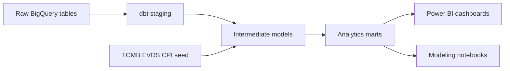

# 3A Superstore Analytics Project

3A Superstore Analytics is a team data analytics project on retail transaction data. The project uses BigQuery, dbt, Python notebooks, Power BI to analyze sales, inflation-adjusted revenue performance, customer behavior, category trends, regional concentration, and retention opportunities.

!!! note "Project takeaway"

    Because the dataset covers Turkish retail sales during a high-inflation period, nominal sales can be misleading. The project combines transaction data with [TCMB EVDS](https://evds3.tcmb.gov.tr) CPI data to compare nominal and real revenue, then checks the result against order, customer, unit, and product-price signals.

## Analysis Portfolio

Each analysis page focuses on a different business question and is owned by a team member.

-   :lucide-turkish-lira:{ .lg .middle } __[Revenue Performance & Inflation Analysis](analyses/inflation-adjusted-revenue.md)__

    ---

    Nominal vs. real revenue, CPI adjustment, product price validation, and inflation-aware KPIs.

    _Author: Doruk Alkan_

-   :lucide-wallet:{ .lg .middle } __[Sales & Revenue Insights](analyses/sales-revenue.md)__

    ---

    Sales trends, order volume, geographic revenue patterns, and revenue forecasting.

    _Author: Ebubekir Tilbaç_

-   :lucide-shopping-cart:{ .lg .middle } __[Customer Growth Opportunities](analyses/customer-growth.md)__

    ---

    Cross-sell opportunities, churn signals, basket diversity, and high-value customers.

    _Author: Ebubekir Tilbaç_

-   :lucide-shield-plus:{ .lg .middle } __[Customer Health](analyses/customer-health.md)__

    ---

    Customer value segmentation, health stages, geographic value concentration, and retention priorities.

    _Author: Yasemen Dündar_

-   :lucide-user-search:{ .lg .middle } __[Customer Retention & RFM Analysis](analyses/customer-retention-rfm.md)__

    ---

    RFM segmentation, active customer rate, revenue at risk, and retention strategy.

    _Author: Yasemen Dündar_

-   :lucide-map-pin:{ .lg .middle } __[Region & Category Performance](analyses/regional-revenue.md)__

    ---

    Regional revenue concentration and category contribution by geography.

    _Author: Eda Bilgin_

-   :lucide-shopping-basket:{ .lg .middle } __[Category Trends](analyses/category-performance-trends.md)__

    ---

    Category revenue, sales quantity, order activity, and category mix stability over time.

    _Author: Eda Bilgin_

## Technical Implementation

The dbt project is organized into a layered model structure:

- Staging models clean raw BigQuery tables for orders, order details, customers, branches, categories, and CPI.
- Intermediate models create reusable analytical logic such as order revenue, branch dimensions, monthly CPI metrics, and item-month pricing.
- Mart models produce dashboard-ready tables for revenue trends, KPI cards, product price trends, category price movement, branch revenue, customer 360, and RFM analysis.
- Custom dbt tests validate grain, reconciliation, CPI math, endpoint windows, and dashboard KPI calculations.

The current dbt graph includes 26 models, 1 seed, and 189 tests after parsing.

## Tools Used

| Tool | Role |
| --- | --- |
| BigQuery | Warehouse, SQL exploration, raw table storage, and analytics outputs. |
| dbt | Transformation modeling, documentation, and automated data tests. |
| Python, Jupyter, Google Colab | Exploratory analysis, validation, and forecasting experiments. |
| Power BI | Final dashboards and business-facing visual analysis. |
| Zensical | Public project website and written portfolio documentation. |

## Project Links

-   :octicons-database-24:{ .lg .middle } __[Dataset](about/dataset.md)__

    ---

    Source dataset, raw table overview, Kaggle citation, and CPI supplement notes.

-   :lucide-users:{ .lg .middle } __[Team](about/team.md)__

    ---

    Team members, ownership, and project focus areas.

-   :fontawesome-brands-github:{ .lg .middle } __[GitHub Repository](https://github.com/dorukalkan/3a-superstore-analysis)__

    ---

    Source code, dbt models, notebooks, query archive, and Zensical site files.

